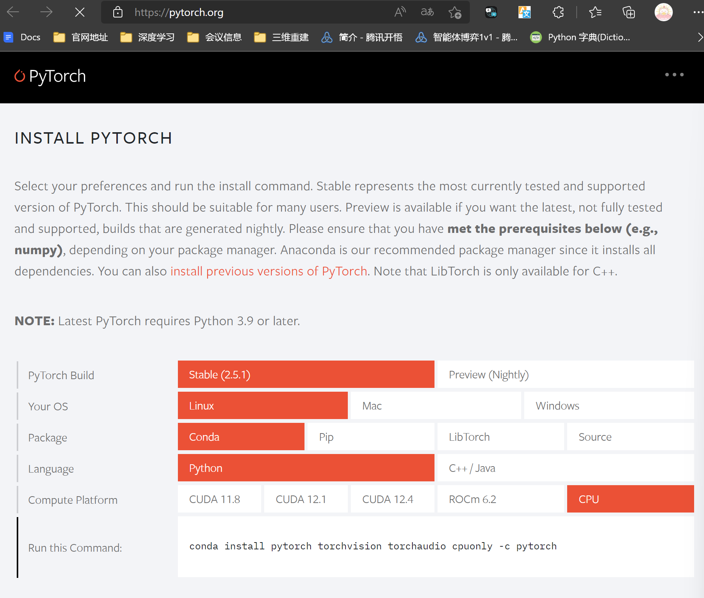
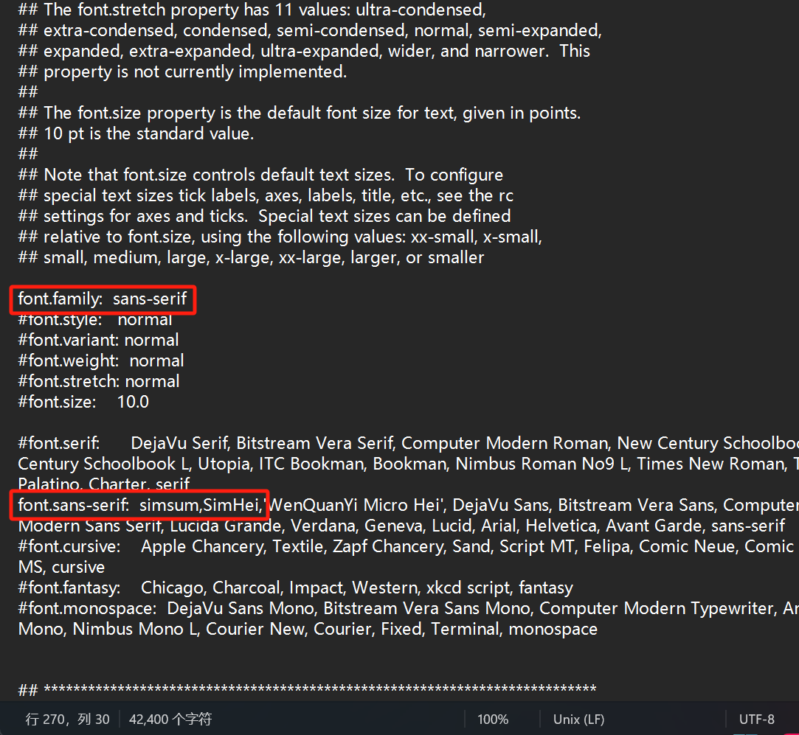

# NLP_-0-1-miniGPT

深度学习与实践课程文件

# 踩坑记录

## 1、安装版本torchtext后一直出现OSError，应该是torch和torchtext版本不匹配出现的问题，尝试了很多方法才正确安装。

### 正确安装方法：

首先在torch官网上找到适合自己环境的torch安装命令，建议使用conda而不是pip。



直接使用Run this Command安装torch

```
conda install pytorch torchvision torchaudio cpuonly -c pytorch
```

然后使用一下命令安装torchtext

```
conda install -c pytorch torchtext
```

就成功了。

最终安装的版本是：

pytorch                   2.5.1

torchtext                 0.6.0

## 2 字体安装

会出现以下报错：`findfont: Font family 'SimHei' not found.`

### 解决办法：

### 1.在C10模块找到字体安装文件位置，安装对应字体SimHei。

运行python代码：

```
import matplotlib
matplotlib.matplotlib_fname()
```

运行结果：

```
'/home/choc01ate/miniconda3/envs/py310/lib/python3.10/site-packages/matplotlib/mpl-data/matplotlibrc'
```

在linux终端中打开以上对应文件夹1：

```
cd /home/choc01ate/miniconda3/envs/py310/lib/python3.10/site-packages/matplotlib/mpl-data/
```

找到该文件夹下的fonts/ttf文件夹，将字体文件安装到此处。

从windows系统，安装到linux系统需要执行scp命令。

### 2.修改配置文件。

在以上打开的文件夹1下，输入：

```
nano matplotlibrc
```

修改文件如下：



### 3.【重要】在文件1下，清除缓存文件。

```
rm -rf ~/.cache/
```

最后重启以下环境即可。
